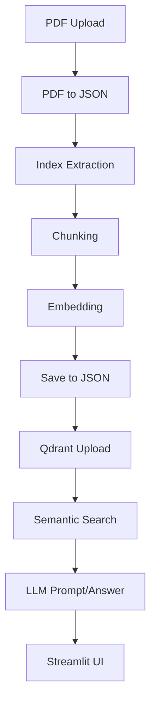

# RAGYY 🚀
**High-Frequency Financial Analysis Bot**  
Python-powered bot for PDF ingestion, semantic search, and LLM-based Q&A with an interactive Streamlit dashboard.

---

## Features ✨

- Real-time financial document analysis  
- PDF → JSON parsing & smart index extraction  
- Metadata-rich chunking & embeddings (Sentence Transformers)  
- Fast semantic search with **Qdrant**  
- LLM-powered answers (Groq) with context citations  
- Interactive **Streamlit** dashboard  

---

## Architecture 🏗️



---

## Tech Stack 🛠️

- Python 3.8+, LangChain, Streamlit  
- PyMuPDF, PyPDF2, pdf2image  
- Sentence Transformers, Groq LLM  
- Qdrant (vector DB)  
- CSS for styling  

---

## Quick Demo 🎬

  


---

## Quick Start ⚡

```bash
# 1. PDF → JSON
python UTILS/pdf_to_json.py

# 2. Extract Index
python UTILS/extract_index.py

# 3. Chunk Document
python UTILS/chunking.py

# 4. Embed Chunks
python UTILS/create_embeding.py

# 5. Save Embeddings
python UTILS/save_to_json.py

# 6. Upload to Qdrant
python UTILS/qdrant.py <embed_json_path> <collection_name> <qdrant_url> [api_key]

# 7. Launch Web UI
streamlit run UTILS/pdf_viewer.py
```

---

## Workflow 🔄

1. **PDF → JSON**  
2. **Index Extraction**  
3. **Chunking (text + metadata)**  
4. **Embedding → Save**  
5. **Qdrant Semantic Search**  
6. **LLM Query → Answers**  
7. **Streamlit Dashboard**  

---

## Configuration ⚙️

- Set chunk size/overlap in chunking step  
- Update embedding model & Qdrant config  
- Set environment variables in `.env` (Groq API key, Qdrant URL/API key)  

---

## Contributing 🤝

1. Fork & clone  
2. Create branch `feature-xyz`  
3. Commit → PR with description  
4. See [CONTRIBUTING.md](CONTRIBUTING.md)  

---

## Roadmap 🛣️

- Multi-file ingestion & batch processing  
- Additional embedding & LLM models  
- Advanced analytics & visualizations  
- User auth & role-based access  
- Cloud-native deployment  

---

## Contact 📬

[GitHub: Rishabh-Sharma-12](https://github.com/Rishabh-Sharma-12)  
--ssrishabh12@gmail.com

---

## Acknowledgements 🙏

- LangChain, Sentence Transformers, Qdrant  
- Groq, Streamlit, Python open-source community  
