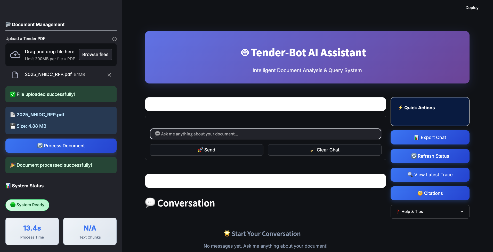
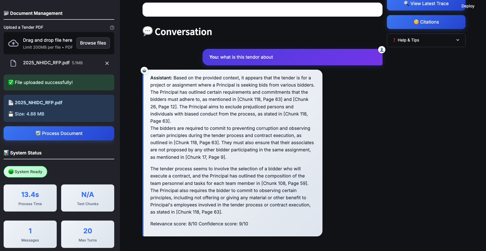
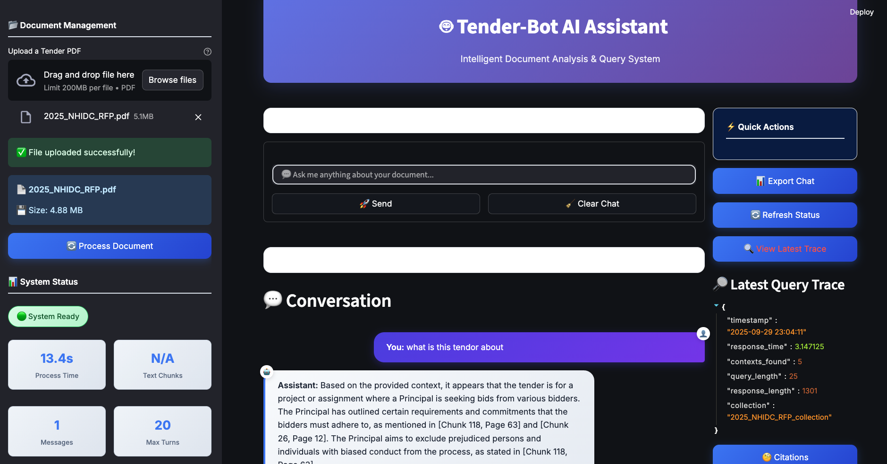
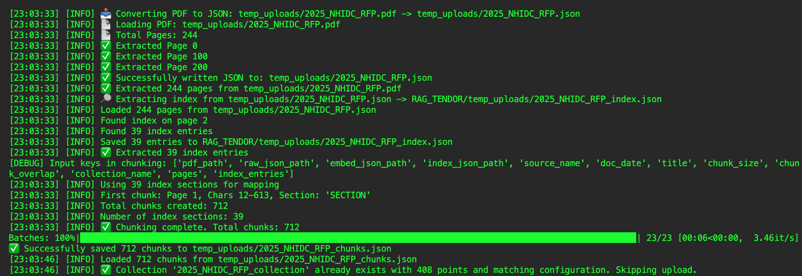
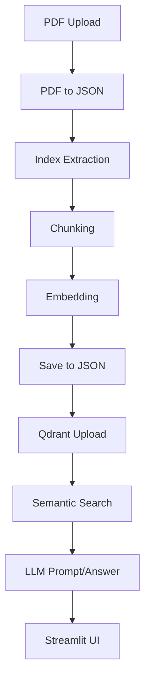

# RAGYY 🚀
**High-Frequency Financial Analysis Bot**  
Python-powered bot for PDF ingestion, semantic search, and LLM-based Q&A with an interactive Streamlit dashboard.

---
## Demo

## 📸 Dashboard Screenshots

### Main View


###


### 


### 


---

## Features ✨

- Real-time financial document analysis  
- PDF → JSON parsing & smart index extraction  
- Metadata-rich chunking & embeddings (Sentence Transformers)  
- Fast semantic search with **Qdrant**  
- LLM-powered answers (Groq) with context citations  
- Interactive **Streamlit** dashboard  

---

## Architecture 🏗️



---

## Tech Stack 🛠️

- Python 3.8+, LangChain, Streamlit  
- PyMuPDF, PyPDF2, pdf2image  
- Sentence Transformers, Groq LLM  
- Qdrant (vector DB)  
- CSS for styling  

---
## API Usage 🛰️

This repository provides a FastAPI backend for document ingestion and high-frequency Q&A.  
You can interact with the API using standard HTTP requests or tools like `curl`, `httpie`, or Postman.

### Endpoints

#### 1. `/process_document/`  
**POST**: Upload and process a financial PDF document.

- **Parameters:**  
  - `file`: PDF upload (form-data)
- **Returns:**  
  - Processing stats, chunk/embedding info, and success message

**Example:**
```bash
curl -X POST "http://localhost:8000/process_document/" \
     -F "file=@yourfile.pdf"
```

#### 2. `/ask/`  
**POST**: Ask questions about the uploaded document.

- **Parameters:**  
  - `query`: Your question (form field)
- **Returns:**  
  - Answer from LLM, source contexts, and trace info

**Example:**
```bash
curl -X POST "http://localhost:8000/ask/" \
     -F "query=What are the key financial highlights?"
```

#### 3. `/status/`  
**GET**: Check API/document status.

- **Returns:**  
  - Document processing status, stats, and chat history count

**Example:**
```bash
curl "http://localhost:8000/status/"
```

---

### Running the API

```bash
uvicorn api:app --reload
```
Default port is `8000`. Update as needed.

---

### Notes

- The API maintains chat history for up to 20 exchanges.
- Make sure the document is processed before asking questions.
- Logs and errors are handled via the built-in logger.


## Quick Demo 🎬

  


---

## Quick Start ⚡

```bash
# 1. PDF → JSON
python UTILS/pdf_to_json.py

# 2. Extract Index
python UTILS/extract_index.py

# 3. Chunk Document
python UTILS/chunking.py

# 4. Embed Chunks
python UTILS/create_embeding.py

# 5. Save Embeddings
python UTILS/save_to_json.py

# 6. Upload to Qdrant
python UTILS/qdrant.py <embed_json_path> <collection_name> <qdrant_url> [api_key]

# 7. Launch Web UI
streamlit run UTILS/pdf_viewer.py
```

---

## Workflow 🔄

1. **PDF → JSON**  
2. **Index Extraction**  
3. **Chunking (text + metadata)**  
4. **Embedding → Save**  
5. **Qdrant Semantic Search**  
6. **LLM Query → Answers**  
7. **Streamlit Dashboard**  

---

## Configuration ⚙️

- Set chunk size/overlap in chunking step  
- Update embedding model & Qdrant config  
- Set environment variables in `.env` (Groq API key, Qdrant URL/API key)  

---

## Contributing 🤝

1. Fork & clone  
2. Create branch `feature-xyz`  
3. Commit → PR with description  
4. See [CONTRIBUTING.md](CONTRIBUTING.md)  

---

## Roadmap 🛣️

- Multi-file ingestion & batch processing  
- Additional embedding & LLM models  
- Advanced analytics & visualizations  
- User auth & role-based access  
- Cloud-native deployment  

---

## Contact 📬

[GitHub: Rishabh-Sharma-12](https://github.com/Rishabh-Sharma-12)  
--ssrishabh12@gmail.com

---

## Acknowledgements 🙏

- LangChain, Sentence Transformers, Qdrant  
- Groq, Streamlit, Python open-source community  
